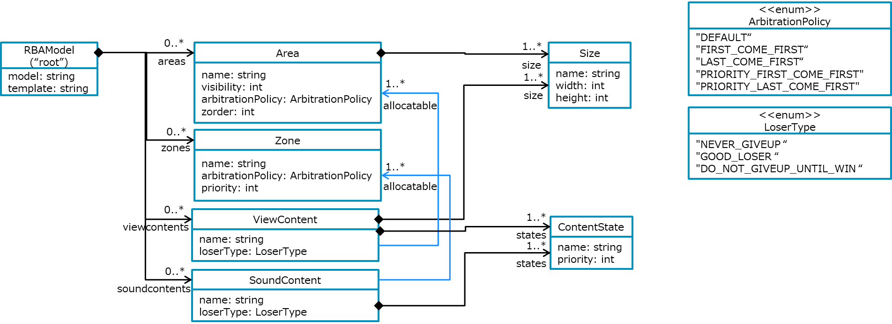
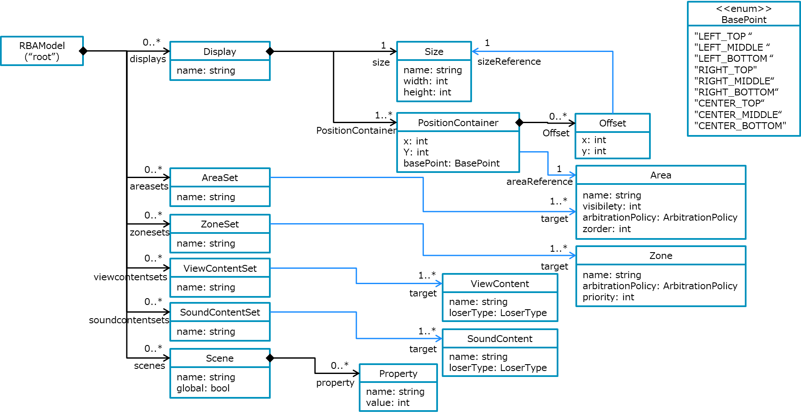
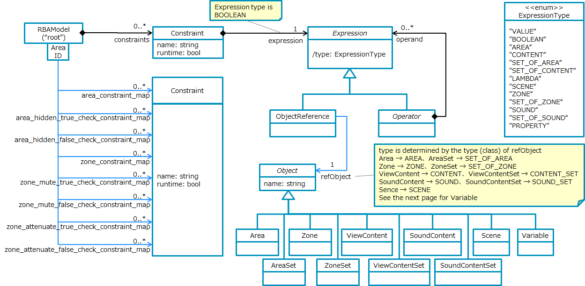
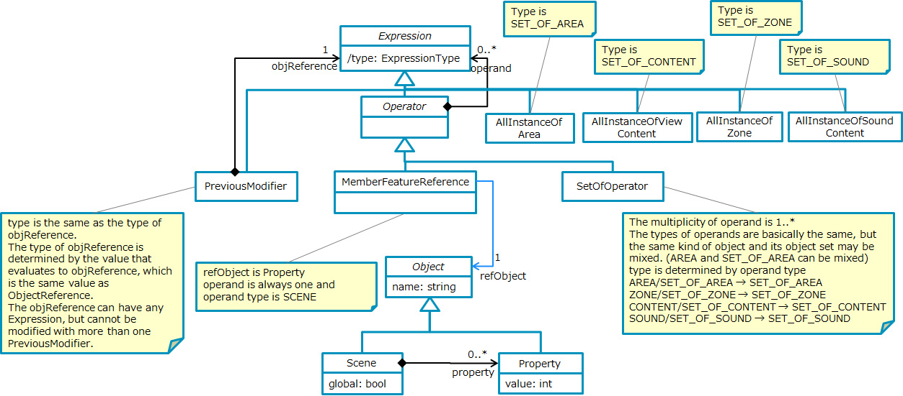
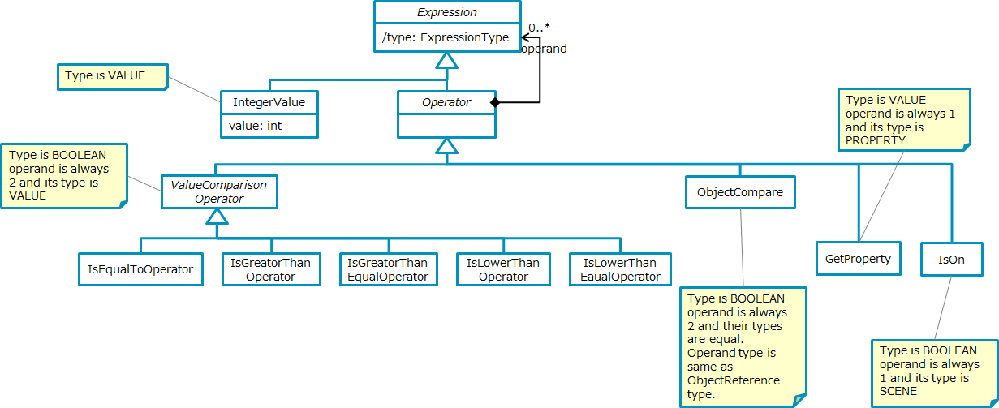
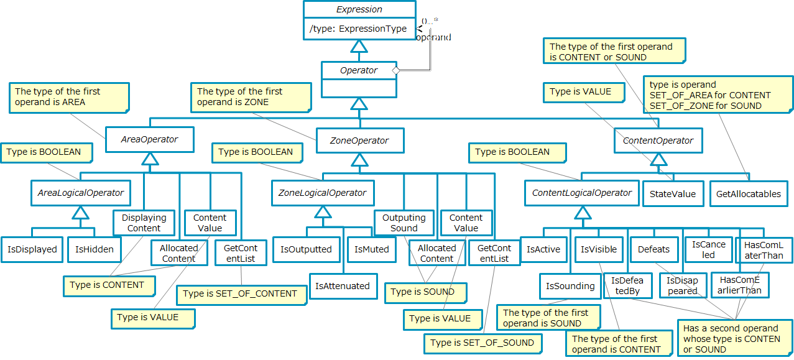

# Explanatory material of JSON file to be read by RBA-FW

## Table of Contents

* [Overview](#anchor1)

* [JSON rule file format](#anchor2)

* [Class property types](#anchor3)

  * Attribute

  * Relation

  * Composition

* [JSON object configuration](#anchor4)

## Overview

The format of the JSON rule file is shown in UML class diagram notation.

## JSON rule file format

The JSON object in the JSON rule file becomes an instance of the UML class.  
What is defined as a class property becomes a property of the JSON object.  
The property name of the class becomes the property name of the JSON object.  
The value of the property of the JSON object differs depending on the property type (attribute, association, composition) of the class.

## Class property types

### Attribute

That value becomes the value of the JSON property as it is.  
The int type attribute is an integer value, and the other attributes are the string representation of that value as the value of the JSON property.  
If it is an enumerated type, it will be the string of its value.

### Relation

The value is either the value of the name of the referencing object or [name]: [class name].  
Which value is used should be compatible with both, as specifications may change in the future.

### Composition

The value will be a JSON object.  
If the class being referred to is an abstract class, a property named className is created in the JSON object that will be its value, and the value of that property will be the name of the class.  
If the class being referred to is a concrete class, className is omitted.  
If the composition multiplicity is multiple, it will be an array of JSON objects.

## JSON object configuration

### #1.

The root object of the JSON rule file is RBAModel, and the attributes are "model" that describes the name and version name of the rule model and "template" that is the version information of the tool that generates the JSON rule file.  
Version information is given to "template" with a six-digit numerical value of "xx.yy.zz".  
zz is updated when there is no change in the format of the JSON rule file due to a bug fix of the JSON generation tool.  
yy is updated when there is a change in the format but it is compatible with the past format.  
xx is updated when there is a change in the format and the compatibility with the past format is lost.  
"areas" stores all areas included in the rule model, "zones" stores all zones, "viewcontents" stores all display contents, and "soundcontents" stores all audio contents.

### #2.

"displays" stores all display objects, and the size and layout information of the display are stored below the object.  
"areasets", "zonesets", "viewcontentsets", and "soundcontentsets" are all area sets, zone sets, display content sets, and audio content sets defined in the model.  
"scenes" stores all scenes defined in the model.

### #3.

"constraints" contains all the constraint expressions defined in the model, the action determination processing constraint expression at the time of defeat, and the control execution expression.  
These objects have an expression.  
The type of Expression is a derived attribute, and its value is determined by the subclass of Expression.  
See the notes in the figure for details.  
"area_constraint_map", "area_hidden_true_check_constraint_map", "area_hidden_false_check_constraint_map", "zone_constraint_map", "zone_mute_true_check_constraint_map", "zone_mute_false_check_constraint_map", and "zone__check_contain_map_int" are maps using the area / zone ID (name) as keys, and correspond to the maps described in the constraint expressions to be evaluated in each area / zone.

### #4.

